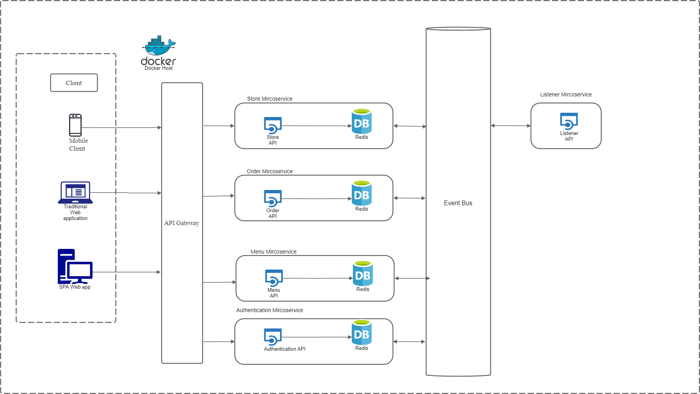

# Microservice

- 1.Authentication service
- 2.Order service
- 3.Store service
- 4.Menu service
- 5.listener service
- 6.Microservices Metrics - Prometheus
- 7.Grafana Dashboard

# Architecture



# The REST API strcture
```
.
├── prometheus.yaml
├── README.md
├── docker-compose.yml
├── test_order_service.py
├── test_menu_service.py
├── test_menu_service.py
├── authentication_service
│   ├── Dockerfile
│   ├── authentication_service.py
│   ├── initialze.py
│   └── README.md
├── order_service
│   ├── Dockerfile
│   ├── order_service.py
│   ├── sample_order_data.json
│   ├── sample_order_data2.json
│   ├── sample_order_data3.json
│   ├── sample_order_data4.json
│   └── README.md
├── store_service
│   ├── Dockerfile
│   ├── requirements.txt
│   └── store_service.py
├── menu_service
│   ├── Dockerfile
│   ├── menu_service.py
│   ├── menu_data.json
│   ├── update_menu.json
│   ├── requirements.txt
│   └── README.md
├── gateway_api
│   ├── Dockerfile
│   └── gateway_api.py
├── lib
│   ├── domain_model.py
│   └── event_store.py
└── grafana
    ├── dashboards
    │   ├── default.yaml
    │   └── mydashboard.json
    └── datasources
        └── default.yaml
```
