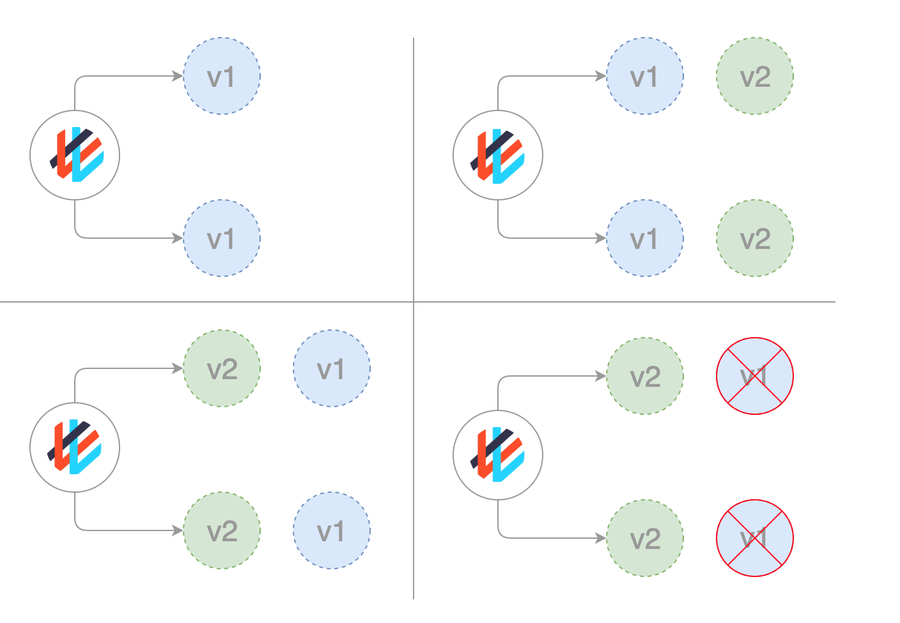

## Стратегия обновления Blue/Green
«Сине-зелёное» развёртывание Kubernetes (иногда называемое «красным/чёрным») предполагает развёртывание новой версии вместе со старой. Внутренняя команда QA может тестировать новую версию (зелёный цвет), в то время как клиент продолжает получать доступ к старой версии (синий цвет). После тестирования и утверждения релиза трафик можно перенаправить на новую версию (зелёный цвет), изменив сервис Kubernetes. После этого, когда разработчики будут уверены в работоспособности релиза, старая версия (синяя) может быть уменьшена до нуля.

Эта стратегия также гарантирует отсутствие простоев в работе клиентов во время развёртывания, а также дает бизнесу дополнительный уровень уверенности в новом сервисе (по результатам QA-тестирования). «Синяя/зелёная» стратегии предполагают больше инженерных работ и являются самыми затратными с точки зрения ресурсов (удвоение ресурсов приложения), однако при необходимости старые версии могут быть немедленно развёрнуты. Развёртывание по схеме «сине-зелёный» является затратным, поскольку требует удвоения ресурсов. Прежде чем запускать платформу в промышленную эксплуатацию, необходимо провести надлежащее тестирование всей платформы. Кроме того, сложно работать с приложениями, имеющими состояние.

Для начала создайте «синюю» установку, сохранив следующий yaml в файл 'blue.yaml':
<pre class="file" data-filename="./blue.yaml" data-target="replace">
apiVersion: apps/v1
kind: Deployment
metadata:
  name: blue-deployment
spec:
  selector:
    matchLabels:
      app: blue-deployment
      version: busybox-128
  replicas: 3
  template:
    metadata:
      labels:
        app: blue-deployment
        version: busybox-128
    spec:
      containers:
        - name: blue-deployment
          image: busybox:1.28
</pre>
Примените манифест:

`kubectl apply -f blue.yaml`{{execute T1}}

Состояние развёртывания можно получить с помощью команды:
`kubectl get deploy blue-deployment `{{execute T1}}

Для более детальной информация, выполните команду:
`kubectl describe deploy blue-deployment `{{execute T1}}

Далее необходимо задать эти метки в качестве селектора меток для сервиса. Сохраните следующий yaml в файле service.yaml, выполнив команду:
<pre class="file" data-filename="./service.yaml" data-target="replace">
apiVersion: v1
kind: Service
metadata: 
  name: blue-green-service
  labels: 
    name: blue-deployment
    version: busybox-128
spec:
  ports:
    - name: http
      port: 80
      targetPort: 80
  selector: 
    name: blue-deployment
    version: busybox-128
  type: LoadBalancer
</pre>
Теперь при создании службы будет создан балансировщик нагрузки, доступный вне кластера.
`kubectl apply -f service.yaml`{{execute T1}}

Для «зелёного» развёртывания необходимо развернуть новое развёртывание параллельно с «синим» развёртыванием. Приведенный ниже шаблон является содержимым файла green.yaml:
<pre class="file" data-filename="./green.yaml" data-target="replace">
apiVersion: apps/v1
kind: Deployment
metadata:
  name: green-deployment
spec:
  selector:
    matchLabels:
      app: green-deployment
      version: busybox-136
  replicas: 3
  template:
    metadata:
      labels:
        app: green-deployment
        version: busybox-136
    spec:
      containers:
        - name: green-deployment
          image: busybox:1.36
</pre>

Примените манифест:
`kubectl apply -f green.yaml`{{execute T1}}

Для просмотра общих результатов работы по подготовке приложения в Kubernetes запустите команду:

`kubectl get pods,deployments,service`{{execute}}

Чтобы перейти в режим green deployment, необходимо обновить селектор для существующего сервиса. Измените service.yaml, поменяв версию селектора на 2, а имя на green-deployment. Таким образом, он будет соответствовать подам в «зелёном» развертывании:
<pre class="file" data-filename="./service.yaml" data-target="replace">
apiVersion: v1
kind: Service
metadata: 
  name: blue-green-service
  labels: 
    name: green-deployment
    version: busybox-136
spec:
  ports:
    - name: http
      port: 80
      targetPort: 80
  selector: 
    name: green-deployment
    version: busybox-136
  type: LoadBalancer
</pre>
Теперь при создании службы будет создан балансировщик нагрузки, доступный вне кластера.
`kubectl apply -f service.yaml`{{execute T1}}

Для просмотра общих результатов работы по подготовке приложения в Kubernetes запустите команду:

`kubectl get pods,deployments,service`{{execute}}

В результате видно подготовленный сервис *LoadBalancer*, а также необходимое количество подов непосредственно для старой и новой версии приложения.

После переключения всего трафика на новую версию, старые экземпляры можно будет выводить из эксплуатации. В заключение можно отметить, что развёртывание по принципу «сине-зелёного» — это «всё или ничего», в отличие от развёртывания по принципу скользящего обновления, при котором нет возможности постепенно распространять новую версию. В этом случае все пользователи получат обновление одновременно, хотя существующим сессиям будет позволено завершить работу на старых экземплярах.

Теперь можно удалить экземпляр развёртывания, выполнив команды:

`kubectl delete -f blue.yaml`{{execute T1}}
`kubectl delete -f green.yaml`{{execute T1}}

При этом, будут удалены все поды.

## Выводы о стратегии обновления Blue/Green
**Плюсы:**
- Мгновенное развертывание/откат.
- Отсутствие проблемы с версионностью, всё состояние приложения изменяется за один раз.

**Минусы:**
- Дороговизна, поскольку требует удвоения ресурсов.
- Перед запуском в промышленную эксплуатацию необходимо провести надлежащее тестирование всей платформы.
- Работа с приложениями, имеющими состояние, может оказаться сложной.

## Стратегия обновления Canary
Развёртывания **Canary** во многом схожи с развёртываниями **Blue/Green**, с той лишь разницей, что новая версия приложения выпускается для небольшого подмножества клиентов. При этом небольшой процент производственного трафика приложения направляется на новую версию, чтобы разработчики могли наблюдать за развёртыванием, пока оно тестируется на реальных клиентах. После того как разработчики будут удовлетворены работой новой версии, они могут начать постепенно увеличивать объём трафика, направляемого на новую версию, пока весь трафик не будет направлен на новую версию. После этого старая версия уменьшается до нуля.

Канареечное развёртывание заключается в постепенном переводе производственного трафика с версии А на версию В. Обычно трафик делится по весу. Например, 90% запросов поступает на версию A, 10% — на версию B. Этот метод чаще всего используется в тех случаях, когда тесты недостаточны или ненадежны, а также если нет уверенности в стабильности нового релиза на платформе.

При планировании развёртывания Canary необходимо учитывать различные моменты:
- Этапы: сколько пользователей и во сколько этапов планируется запустить «канарейку».
- Продолжительность: как долго планируется использовать канареечные релизы? Они отличаются тем, что необходимо дождаться обновления достаточного количества клиентов, прежде чем станет возможным оценка результатов. Это может происходить в течение нескольких дней или даже недель.
- Метрики: какие метрики необходимо регистрировать для анализа прогресса, включая производительность приложения и отчёты об ошибках? Хорошо подобранные параметры очень важны, так как позволяют отслеживать состояние развёртывания. Например, очень простым способом оценки развёртывания являются коды состояния HTTP. Можно иметь простую службу ping, которая при успешном развёртывании возвращает 200. При возникновении проблем с развёртыванием он будет возвращать ошибку конца сервера (5xx).
- Оценка: какие критерии будут использоваться для определения успешности работы данной стратегии развёртывания.

Первый файл, stable.yaml, будет представлять собой устаревшую версию, на которой будет работать большинство подсистем.
<pre class="file" data-filename="./stable.yaml" data-target="replace">
apiVersion: apps/v1
kind: Deployment
metadata:
  name: helloworld
spec:
  selector:
    matchLabels:
      app: helloworld
  replicas: 3
  strategy:
    rollingUpdate:
      maxSurge: 1
      maxUnavailable: 1
  minReadySeconds: 5
  template:
    metadata:
      labels:
        app: helloworld
        track: stable
    spec:
      containers:
      - name: helloworld
        image: educative/helloworld:1.0
        ports:
        - containerPort: 80
        resources:
          requests:
            cpu: 50m
          limits:
            cpu: 100m
</pre>

В результате будет создано 3 Pods v1 с меткой app:helloworld, которую ищет сервис Kubernetes. Образ для этих подов — educative/helloworld:1.0, означает, что эти поды будут созданы на основе старых спецификаций подов.

Это развёртывание равномерно распределит любую рабочую нагрузку между доступными Pod.

Для развёртывания необходимо ввести в командную строку следующую строку:
`kubectl apply -f stable.yaml`{{execute T1}}

Состояние развёртывания можно получить с помощью команд:

`kubectl get deploy`{{execute T1}}

Создайте новый манифест для новой версии приложения:
<pre class="file" data-filename="./canary.yaml" data-target="replace">
apiVersion: apps/v1
kind: Deployment
metadata:
  name: helloworld-canary
spec:
  selector:
    matchLabels:
      app: helloworld
  replicas: 1
  strategy:
    rollingUpdate:
      maxSurge: 1
      maxUnavailable: 1
  minReadySeconds: 5
  template:
    metadata:
      labels:
        app: helloworld
        track: canary
    spec:
      containers:
      - name: helloworld
        image: educative/helloworld:2.0
        ports:
        - containerPort: 80
        resources:
          requests:
            cpu: 50m
          limits:
            cpu: 100m
</pre>

Для этого развёртывания необходимо создать только один под (строка 6), чтобы обеспечить взаимодействие большинства наших пользователей с **v1**. Оба развёртывания сбалансируют рабочую нагрузку между всеми подами, что гарантирует, что только 25% нашей рабочей нагрузки будет приходиться на обновлённый под.

Для развёртывания необходимо ввести в командную строку следующую строку:
`kubectl apply -f canary.yaml`{{execute T1}}

Состояние развёртывания можно получить с помощью команд:

`kubectl get deploy`{{execute T1}}

После того как убедились, что **v2** работает, необходимо заменить образ в первом YAML-файле Deployment, stable.yaml, на educative/helloworld:2.0, вместо educative/helloworld:1.0.

Затем удалите Сanary Deployment с помощью команды:
`kubectl delete -f canary.yaml`{{execute T1}}

В этом случае все поды будут иметь **v2**, а нагрузка будет сбалансирована между оставшимися 3 подами, но уже с v2 приложения.

Обновление Canary достигнуто.

## Выводы о стратегии обновления Canary

**Плюсы:**
- Версия, выпущенная для подмножества пользователей.
- Удобна для мониторинга количества ошибок и производительности.
- Быстрый откат.

**Минусы:**
- Замедленное развёртывание.

Две оставшиеся стратегии обновления рассмотрим тезисно.

## Стратегия обновления A/B Testing
A/B-тестирование подразумевает проведение тестирования подмножества пользователей на предмет использования новой функциональности при определённых условиях. Обычно это не стратегия развёртывания, а метод принятия бизнес-решений на основе статистики. Тем не менее, это связано и может быть реализовано путем добавления дополнительной функциональности в канареечное развёртывание.

Эта техника широко используется для тестирования конверсии той или иной функции и запуска только той версии, которая даёт наибольшую конверсию. Ниже приведен список условий, которые могут быть использованы для распределения трафика между версиями:
- По cookie браузера;
- Параметры запроса;
- Геолокация;
- Технологическая поддержка: версия браузера, размер экрана, операционная система и т.д.;
- Язык.

## Выводы о стратегии обновления A/B Testing
**Плюсы:**
- Параллельная работа нескольких версий.
- Полный контроль над распределением трафика.

**Минусы:**
- Требуется интеллектуальный балансировщик нагрузки.
- Сложность поиска ошибок для конкретного сеанса, обязательной становится распределенная трассировка.

## Стратегия обновления Shadow
Теневая стратегия предполагает развёртывание новой версии параллельно со старой и последующую переброску реального трафика клиентов из старой версии в новую. Это позволяет протестировать новую версию на реальном клиентском трафике без ущерба для клиента. Полное развёртывание новой версии начинается, когда стабильность и производительность соответствуют требованиям.

Эта методика достаточно сложна в настройке и требует особых требований, особенно при работе с исходящим трафиком. Например, на платформе корзины покупок при теневом тестировании платёжного сервиса можно столкнуться с тем, что клиент дважды оплатит свой заказ. В этом случае можно решить проблему, создав имитационный сервис, который будет копировать ответ от платёжной системы.

## Выводы о стратегии обновления Shadow
**Плюсы:**
- Тестирование производительности приложения с производственным трафиком.
- Отсутствие воздействия на пользователя.
- Развёртывание не производится до тех пор, пока стабильность и производительность приложения не будут соответствовать требованиям.

**Минусы:**
- Затратно, поскольку требует удвоения ресурсов.
- Не является настоящим пользовательским тестированием и может вводить в заблуждение.
- Сложность в настройке.
- Для некоторых случаев требуется использование mocking-сервиса.
