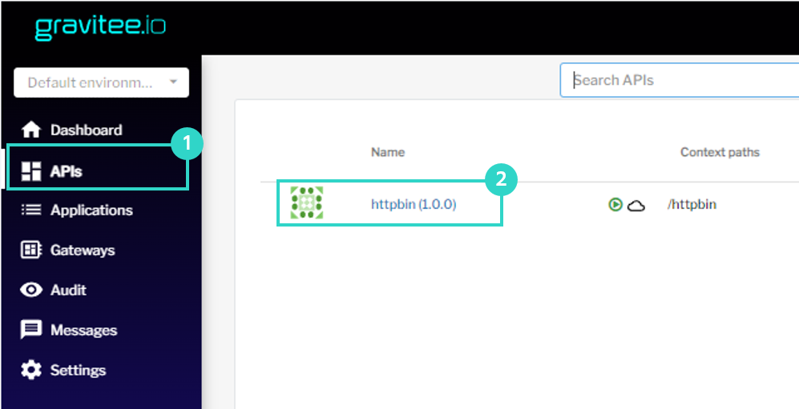
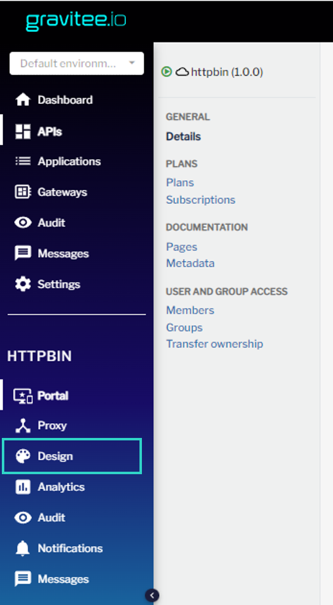
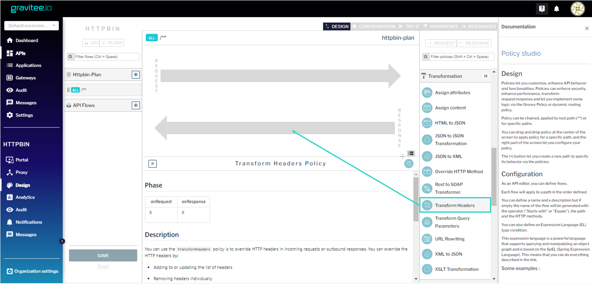
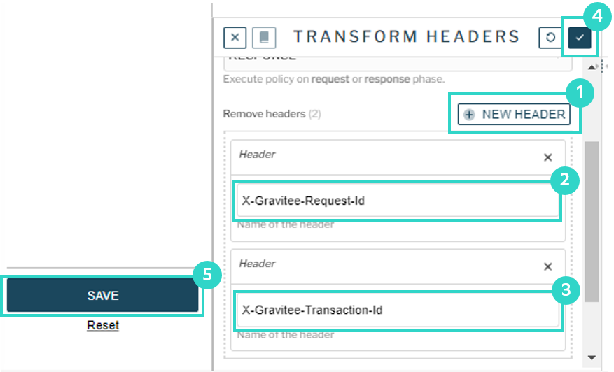
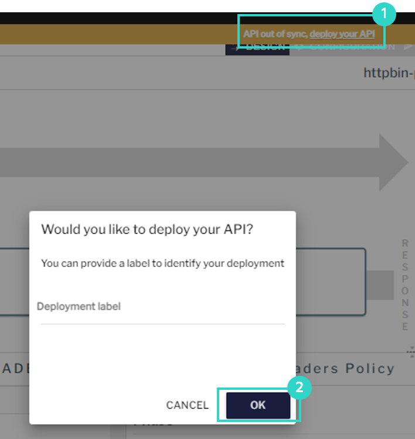

### Авторизация в Gravitee APIM
Откройте интерфейс [Gravitee APIM](https://[[HOST_SUBDOMAIN]]-32100-[[KATACODA_HOST]].environments.katacoda.com/) и авторизуйтесь в нём. 
```
Права администратора
user: admin
pasword: admin
```
### Настройки плана
План предоставляет сервис и уровень доступа к API для конкретных потребителей. В данном случае манипуляции с маппингами ответов будут осуществляться в рамках существующего, ранее загруженного плана.
После авторизации в API Gateway перейдите в «APIs» и откройте «httpbin»:



Далее перейдите в «Design»:



Добавьте компонент «Transform Headers» из блока «Transformation» в поле «Response» (перетащите мышью на стрелку «Response»)



В блоке «Remove headers» укажите заголовки, которые необходимо удалить.

Нажмите кнопку «OK», а затем «SAVE», чтобы сохранить изменения.



Нажмите «deploy your api» на вплывающей полосе вверху экрана, а затем «OK» чтобы применить изменения.


### Проверка изменений

Выполните запрос к API, опубликованному через API Gateway:

`curl -v http://localhost:32100/gateway/httpbin/get`{{execute}}

Обратите внимание, что httpbin работает как и раньше, он прислал в JSON-ответе все заголовки, которые к нему пришли, в том числе и «X-Gravitee-Request-Id», «X-Gravitee-Transaction-Id». А вот в самом ответе API Gateway эти заголовки отсутствуют. Они были удалены согласно выполненным настройкам.

Пример ответа:
```
< HTTP/1.1 200 OK
< Date: Sat, 25 Dec 2021 10:07:27 GMT
< Content-Type: application/json
< Content-Length: 484
< Connection: keep-alive
< Access-Control-Allow-Origin: *
< Access-Control-Allow-Credentials: true
< 
{
  "args": {}, 
  "headers": {
    "Accept": "*/*", 
    "Accept-Encoding": "deflate, gzip", 
    "Host": "httpbin.default:8000", 
    "User-Agent": "curl/7.68.0", 
    "X-Forwarded-Host": "localhost:32100", 
    "X-Forwarded-Scheme": "http", 
    "X-Gravitee-Request-Id": "ba370e6f-21b7-47b5-b70e-6f21b7c7b5c1", 
    "X-Gravitee-Transaction-Id": "ba370e6f-21b7-47b5-b70e-6f21b7c7b5c1", 
    "X-Scheme": "http"
  }, 
  "origin": "10.42.0.1", 
  "url": "http://localhost:32100/get"
}
```

