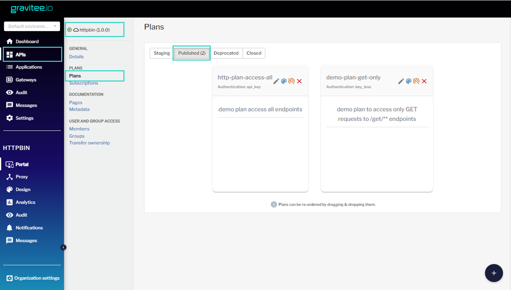
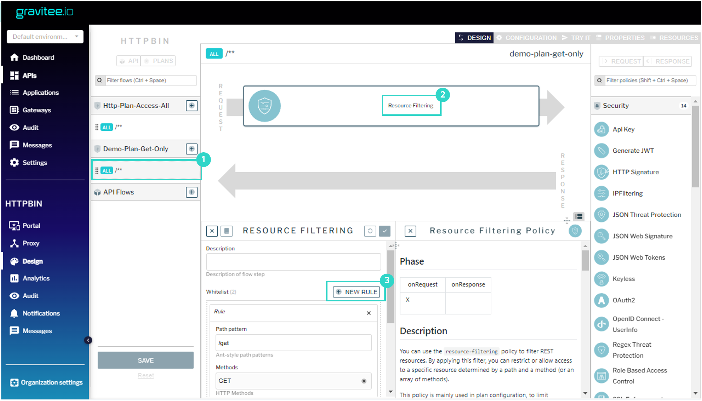
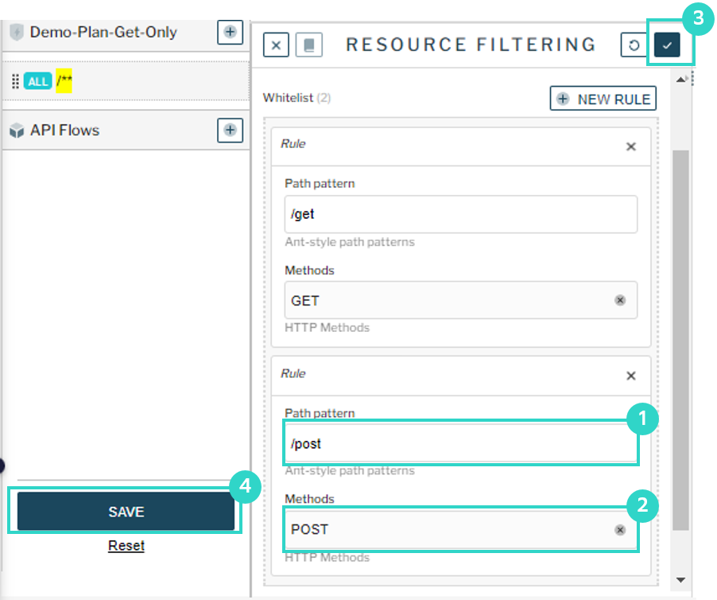

### Авторизация в Gravitee APIM
Откройте интерфейс [Gravitee APIM](https://[[HOST_SUBDOMAIN]]-32100-[[KATACODA_HOST]].environments.katacoda.com/) и авторизуйтесь в нём. 
```
Права администратора
user: admin
pasword: admin
```
### Настройки плана публичного доступа
Чтобы изменить правила публичного доступа к API, необходимо добавить в план доступ к /post для POST запросов.

Откройте импортированное API и перейдите в дизайнер плана «demo-plan-get-only»:
 
Выберите компонент «Resource filtering» и добавьте в белый список ещё одну конечную точку (endpoint):

Сохраните изменения:

Нажмите «deploy» на всплывающей полосе вверху экрана, чтобы опубликовать их.

Проверьте изменения, выполнив запрос типа POST без авторизации к /post:

`curl -XPOST http://localhost:32100/gateway/httpbin/post`{{execute}}
Если всё настроено верно — запрос успешно выполнится.

