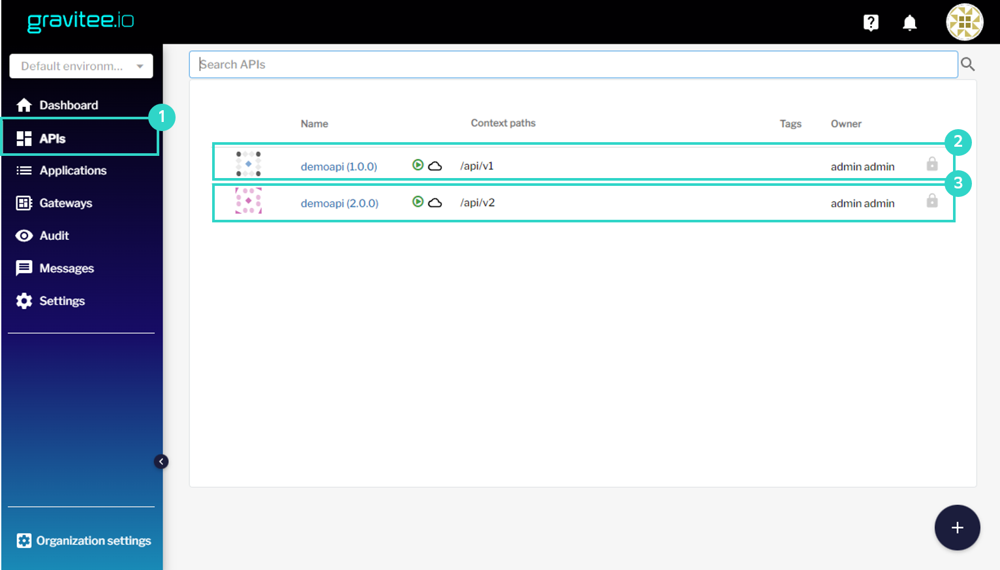
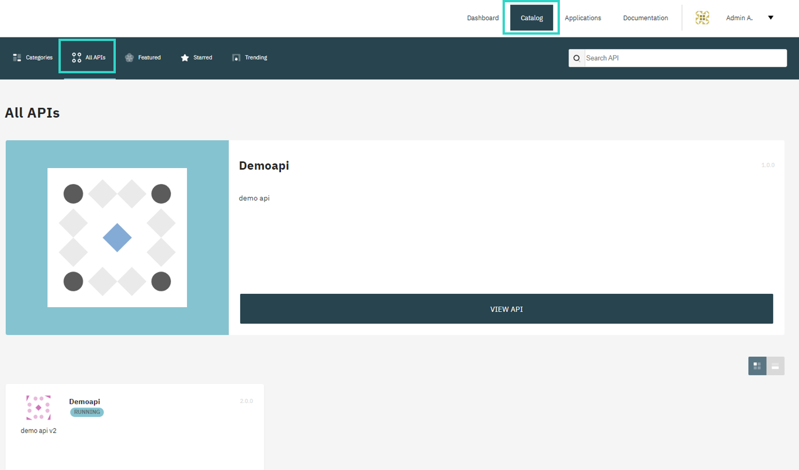
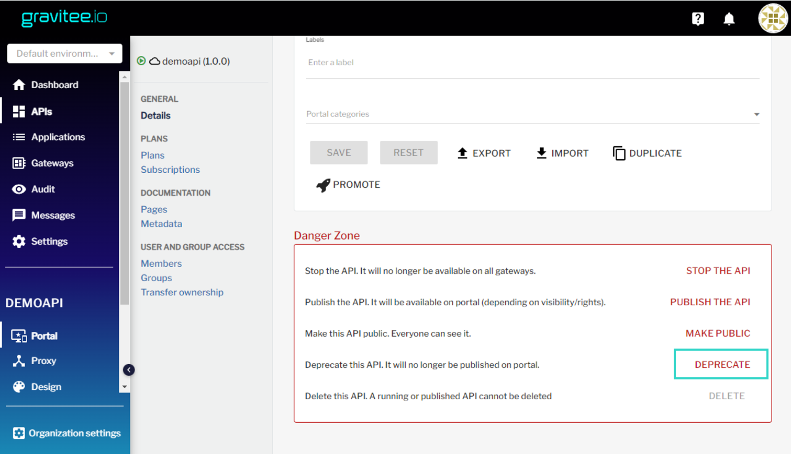

### Авторизация в Gravitee APIM
Откройте интерфейс [Gravitee APIM](https://[[HOST_SUBDOMAIN]]-32100-[[KATACODA_HOST]].environments.katacoda.com/) и авторизуйтесь в нём. 
```
Права администратора
user: admin
pasword: admin
```
### Публикация API на портал
Откройте поочередно функции, указанные на рисунке:



Опубликуйте их на портале:


### Просмотр версий API

Откройте в новой вкладке [портал](https://[[HOST_SUBDOMAIN]]-32100-[[KATACODA_HOST]].environments.katacoda.com/portal-ui)

Перейдите в каталог для просмотра всех доступных для пользователей API.

Обратите внимание, что отображаются две версии Demoapi:


### Deprecate API

Предположим, версия 1.0.0 Demoapi устарела, Вы не хотите выводить её на портале и давать возможность её использования новым пользователям.

Откройте интерфейс [Gravitee APIM](https://[[HOST_SUBDOMAIN]]-32100-[[KATACODA_HOST]].environments.katacoda.com/) и выберите Demoapi 1.0.0.
Нажмите Deprecate.
Интерфейс предупредит, что API помечено как устаревшее.


На портале данная версия больше не отображается, тем не менее для текущих клиентов она всё ещё доступна. В данном случае, так как API доступно без авторизации, запрос к нему может выполнить любой клиент. 

Проверьте доступность, выполнив запрос к версии 1.0.0:
`curl http://localhost:32100/gateway/api/v1`{{execute}}

